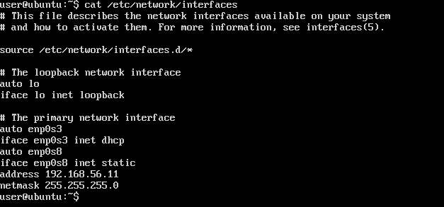

# Práctica 1: Preparación de las herramientas
## Breve descripción de la práctica

Tras instalar las dos máquinas Linux con el Ubuntu Server, en ambas vamos a realizar
una instalación completa de servidor web: Apache + PHP + MySQL.

Una vez que tengamos las máquinas instaladas y los servidores LAMP configurados,
comprobaremos que Apache está funcionando.

## Objetivos

1. Acceder por ssh de una máquina a otra
2. Acceder mediante la herramienta curl desde una máquina a la otra

## Proceso
*descripción del proceso*

