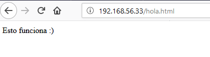
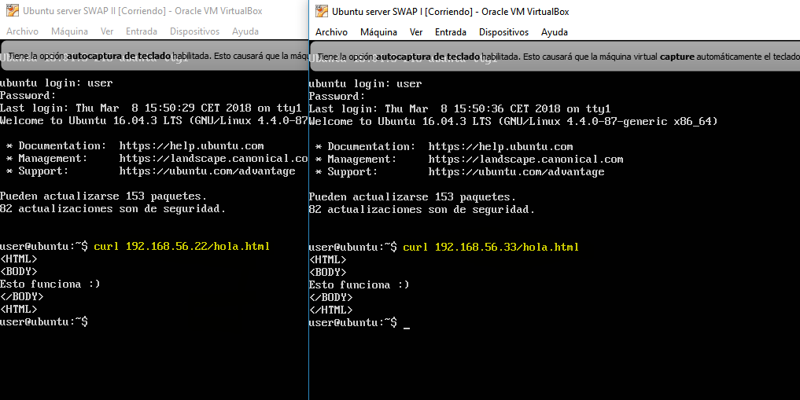
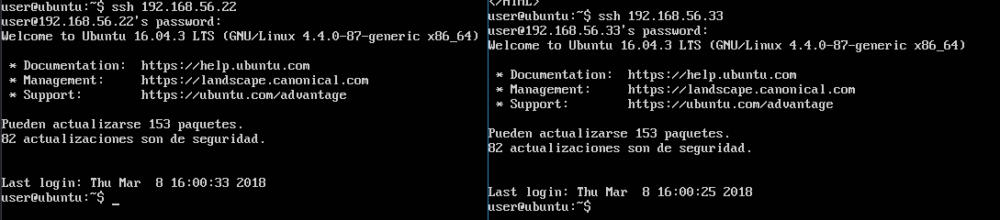

# Práctica 1: Preparación de las herramientas
## Breve descripción de la práctica

Tras instalar las dos máquinas Linux con el Ubuntu Server, en ambas vamos a realizar
una instalación completa de servidor web: Apache + PHP + MySQL.

Una vez que tengamos las máquinas instaladas y los servidores LAMP configurados,
comprobaremos que Apache está funcionando.

## Objetivos

1. Acceder por ssh de una máquina a otra
2. Acceder mediante la herramienta curl desde una máquina a la otra

## Proceso

#### 1. Accedemos al archivo situado en la ruta:

```
/etc/network/interfaces
```


#### 2. Lo modificamos de forma que quede como en la siguiente imagen:

  
*La dirección ip debe ser distinta para cada máquina*

#### 3. Reiniciamos los servicios con el siguiente comando para aplicar los cambios:


#### 4. Comprobamos que desde el host podemos acceder al archivo de una de las máquinas:



#### 5. Comprobamos que podemos acceder al archivo hola.html mediante curl desde una máquina a otra:



#### 6. Por último, vemos que podemos acceder mediante ssh a una máquina desde la otra:

