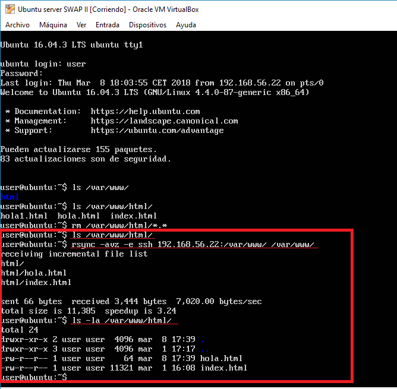
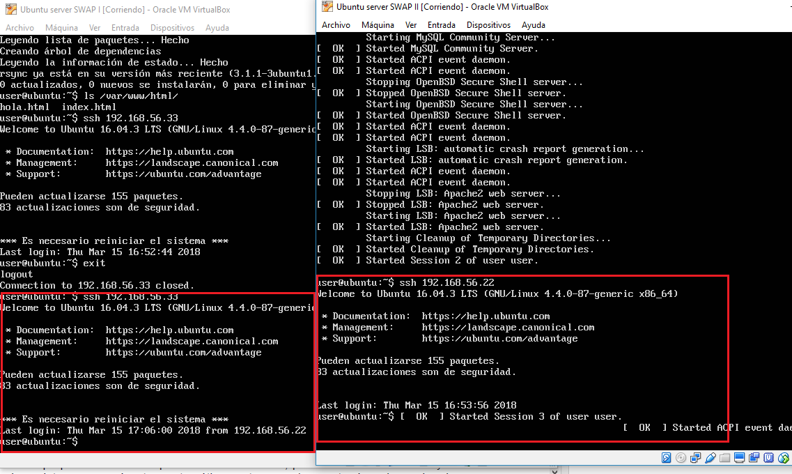
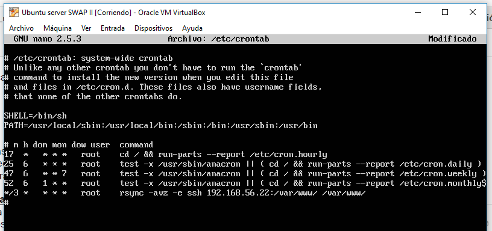

# Práctica 2: Clonar la información entre servidores.
## Breve descripción de la práctica

En esta práctica el objetivo es configurar las máquinas virtuales para trabajar en modo
espejo, consiguiendo que una máquina secundaria mantenga siempre actualizada la
información que hay en la máquina servidora principal.

## Objetivos
1. Aprender a copiar archivos mediante ssh.
2. Clonar contenido entre máquinas.
3. Configurar el ssh para acceder a máquinas remotas sin contraseña.
4. Establecer tareas en cron.

## Proceso

#### 1.Clonación de archivos
Mediante rsync comprobamos que es posible clonar los archivos de una máquina a otra:



#### 2.Acceso mediante ssh sin contraseña

Mediante ssh-keygen podemos generar la clave, con la opción -t para el tipo de clave.
Así, en la máquina secundaria ejecutaremos:
```
ssh-keygen -b 4096 -t rsa
```
A continuación deberemos copiar la clave pública al equipo remoto. Para hacer la copia usaremos el siguiente comando:
```
ssh-copy-id maquina1
```
A continuación ya podremos conectarnos a dicho equipo sin contraseña:



#### 3.Establecer tareas en cron
cron es un administrador procesos en segundo plano que ejecuta procesos en el instante indicado en el fichero crontab.
Para ello, debemos editar el archivo /etc/crontab.



A partir de ahora, se ejecutará la tarea de sincronizacioón automáticamente.
