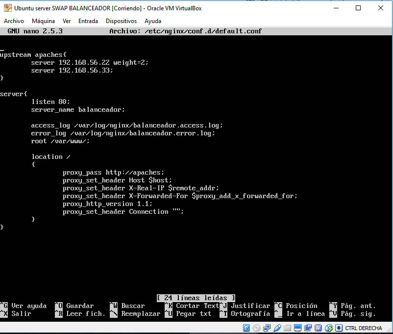
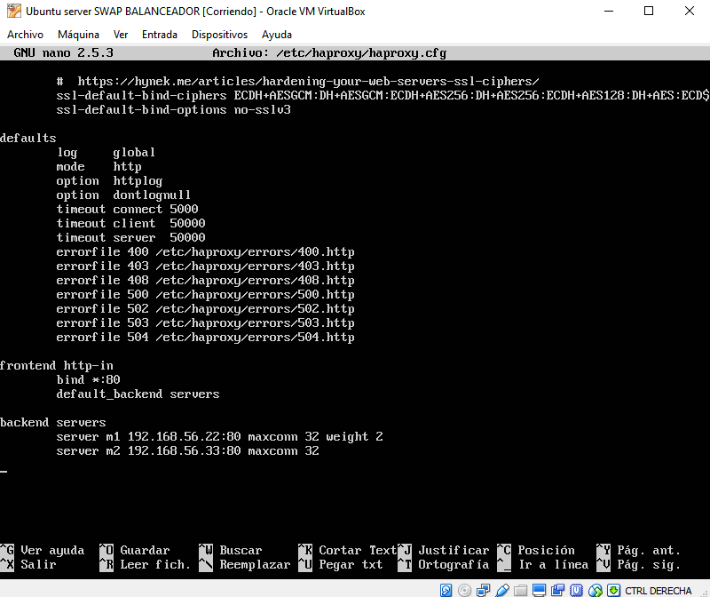
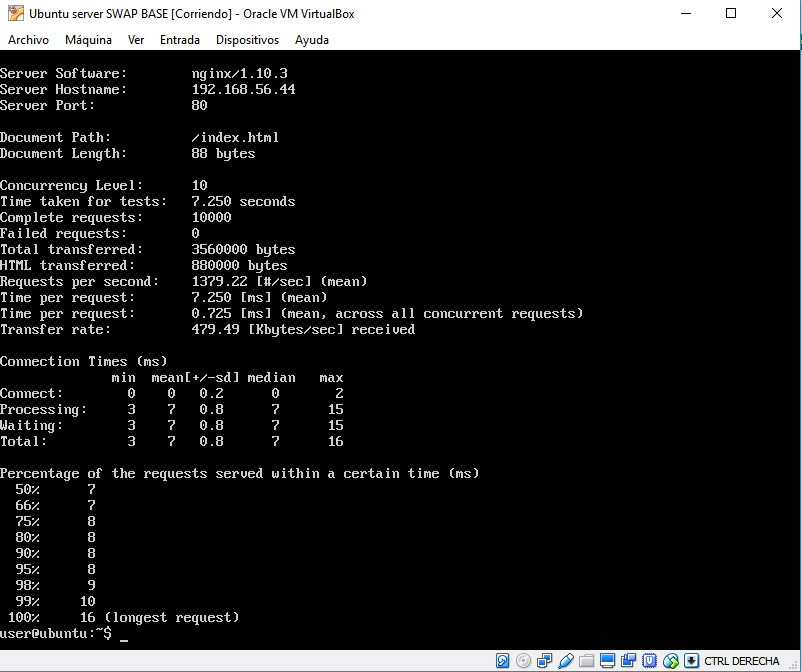
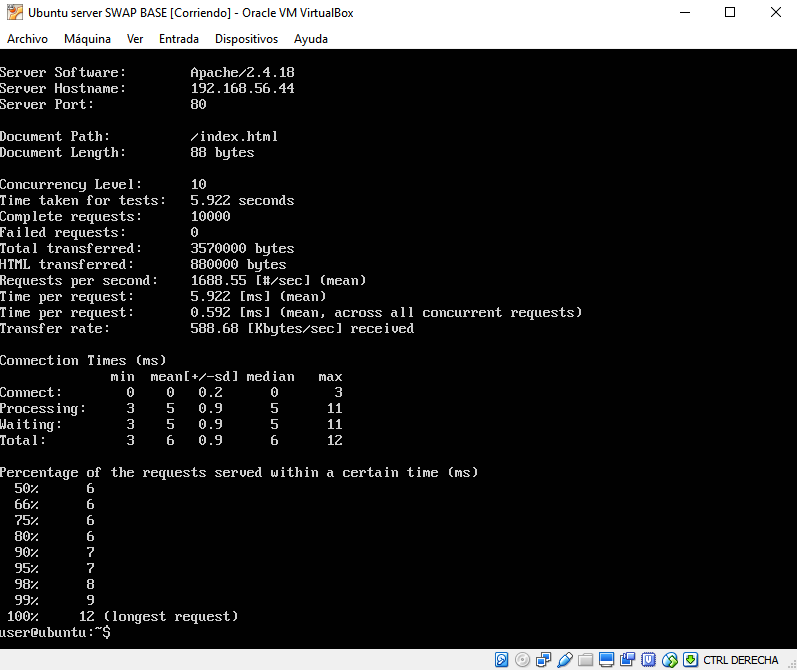

# Práctica 3. Balanceo de carga

## 1. Objetivos de la práctica

En esta práctica configuraremos una red entre varias máquinas de forma que
tengamos un balanceador que reparta la carga entre varios servidores finales.
El problema a solucionar es la sobrecarga de los servidores.

### 2. El servidor web nginx
nginx (pronunciado en inglés “engine X”) es un servidor web ligero de alto rendimiento. Debido a su buen rendimiento, se usa como servidor web en lugar del Apache o IIS, aunque uno de los usos más extendidos es como balanceador de carga en un cluster web.

#### 2.1. Instalar nginx en Ubuntu Server

Para hacer la instalación, se recomienda ejecutar las siguientes
órdenes:
```
sudo apt-get update && sudo apt-get dist-upgrade && sudo apt-get autoremove
sudo apt-get install nginx
sudo systemctl start nginx
```
Una vez instalado, podemos proceder a su configuración como balanceador de carga.

#### 2.2. Balanceo de carga usando nginx
Tenemos que modificar el fichero de configuración /etc/nginx/conf.d/default.conf de forma que quede como se observa en la imagen:



Con ``` weight=2  ``` hacemos que de cada tres peticiones, dos sean redirigidas a ese server.

### 3. Balanceo de carga con haproxy
haproxy es un balanceador de carga y también proxy, de forma que puede balancear cualquier tipo de tráfico.
Es un software muy adecuado para repartir carga y construir una infraestructura de altas prestaciones.

#### 3.1. Instalar haproxy
Sólo tenemos que usar apt-get para instalar haproxy:
```
sudo apt-get install haproxy
```

#### 3.2. Configuración básica de haproxy como balanceador
Debemos modificar el archivo /etc/haproxy/haproxy.cfg de forma que quede como en la siguiente imagen:



Utilizamos ``` weight=2  ``` en el server que hemos elegido con el mismo objetivo que lo hicimos al usar nginx.

### 4. Comprobar el funcionamiento del balanceador
Teóricamente, si accediéramos a una dirección donde estuviera instalado nginx o haproxy tal y como se ha visto en los apartados anteriores, el balanceador debería enviar algunas veces la carga al servidor 1 y otras al servidor 2.


Viendo las imágenes podemos comprobar que, efectivamente, para una misma ip (192.168.56.44) nos remite a veces a la máquina 1 o otras a la máquina 2.

### 5. Someter a una alta carga el servidor balanceado
Para medir el rendimiento de un servidor necesitaremos una herramienta que ejecutar en los clientes para crear una carga HTTP específica (habitualmente alta). En este caso usaremos Apache Benchmark.

Apache Benchmark (ab) es una utilidad que se instala junto
con el servidor Apache y permite comprobar el rendimiento de cualquier servidor web.
Para utilizarlo debemos ejecutar el comando siguiente:
```
ab -n 1000 -c 10 http://192.168.2.121/index.html
```

#### 5.1 Comparación entre nginx y haproxy

A continuación, se mostrará el resultado obtenido con Apache Benchmark con 10000 peticiones para nginx y haproxy.

##### 5.2. NGINX



##### 5.3. HAPROXY



#### 5.4 Conclusión

Viendo los resultados obtenidos, podemos decir que haproxy ha mostrado unos resultados levemente mejores que los de nginx. Concretamente, la petición más lenta con haproxy ha sido de 12 ms, mientras que la de nginx asciende hasta los 16ms. Por otra parte, el 58% de las peticiones usando haproxy han tardado 6ms o menos, mientras que sólo el 50% de las peticiones con nginx han tardado 7 ms o menos.
