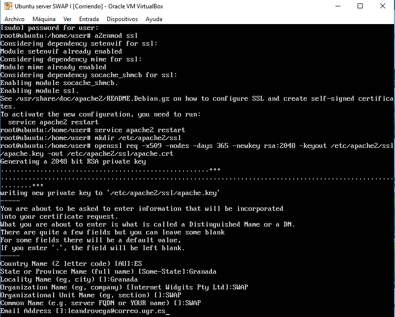
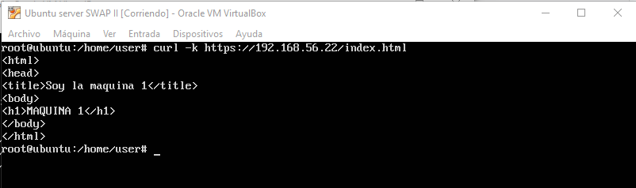
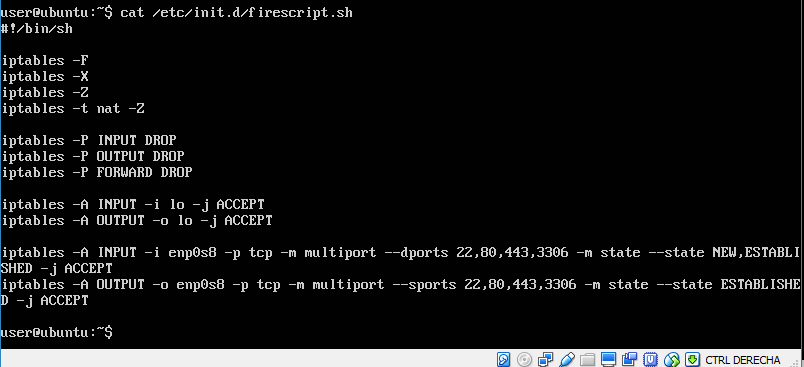

# Práctica 4. Asegurar la granja web

## 1. Objetivos de la práctica

El objetivo de esta práctica es llevar a cabo la configuración de seguridad de la granja web. Para ello, instalaremos un certificado SSL para configurar el acceso HTTPS a los servidores y configuraremos las reglas del cortafuegos para proteger la granja web.

## 2. Instalar un certificado SSL autofirmado para configurar el acceso por HTTPS

Para generar un certificado SSL autofirmado en Ubuntu Server solo debemos activar el módulo SSL de Apache, generar los certificados y especificarle la ruta a los certificados en la configuración. Lo haremos ejecuntando los siguientes comandos en orden:

```
a2enmod ssl
service apache2 restart
mkdir /etc/apache2/ssl
openssl req -x509 -nodes -days 365 -newkey rsa:2048 -keyout /etc/apache2/ssl/apache.key -out /etc/apache2/ssl/apache.crt
```

A continuación se requerirán ciertos datos para el certificado.



Editamos el archivo de configuración del sitio default-ssl:
```
nano /etc/apache2/sites-available/default-ssl
```

Y agregamos estas lineas debajo de donde pone SSLEngine on:
```
SSLCertificateFile /etc/apache2/ssl/apache.crt
SSLCertificateKeyFile /etc/apache2/ssl/apache.key
```
Activamos el sitio default--ssl y reiniciamos apache:
```
a2ensite default-ssl
service apache2 reload
```

Para hacer peticiones por HTTPS utilizando la herramienta curl, ejecutaremos:
```
curl –k https://<ipmaquina1>/index.html
```

Vemos que no hay ningún error:


## 3. Configuración del cortafuegos
Mostraremos cómo utilizar la herramienta para establecer ciertas
reglas y filtrar algunos tipos de tráfico, o bien controlar el acceso a ciertas páginas.

Para comprobar el estado del cortafuegos, debemos ejecutar:
```
iptables –L –n -v
```

Crearemos un script [que se ejecute al iniciar el sistema](https://www.alvarolara.com/2013/03/20/ejecutar-un-script-al-iniciar-sesion-en-ubuntu/) que modifique las reglas de iptables.


