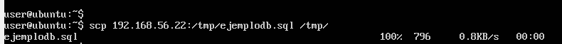
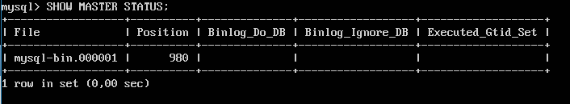
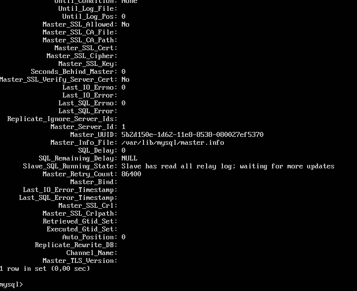

# Práctica 5. Replicación de bases de datos MySQL

## 1. Objetivos de la práctica

Los objetivos concretos de esta práctica son:
- Copiar archivos de copia de seguridad mediante ssh.
- Clonar manualmente BD entre máquinas.
- Configurar la estructura maestro-esclavo entre dos máquinas para realizar el clonado automático de la información

## 2. Crear una base de datos e insertar datos

Para la práctica debemos crearnos una BD en MySQL e insertar algunos datos. Así tendremos datos con los cuales hacer las copias de seguridad.
Accedemos a MySQL, creamos una base de datos y creamos una tabla en ella.

## 3. Replicar una BD MySQL con mysqldump

mysqldump es parte de los programas de cliente de MySQL, que puede ser utilizado para generar copias de seguridad de BD. Puede utilizarse para volcar una o varias BD para copia de seguridad o para transferir datos a otro servidor SQL (no necesariamente un servidor MySQL). EL volcado contiene comandos SQL para crear la BD, las tablas y rellenarlas.

Para realizar la réplica, en primer lugar debemos evitar que se acceda a la BD para cambiar nada.
```
mysql -u root –p
mysql> FLUSH TABLES WITH READ LOCK;
mysql> quit
```
Ahora ya sí podemos hacer el mysqldump para guardar los datos. En el servidor
principal (maquina1) hacemos:
```
mysqldump ejemplodb -u root -p > /tmp/ejemplodb.sql
```

Como habíamos bloqueado las tablas, debemos desbloquearlas (quitar el “LOCK”):
```
mysql -u root –p
mysql> UNLOCK TABLES;
mysql> quit
```

Ya podemos ir a la máquina esclavo (maquina2, secundaria) para copiar el archivo .SQL con todos los datos salvados desde la máquina principal (maquina1)
```
scp maquina1:/tmp/ejemplodb.sql /tmp/
```


Con el archivo de copia de seguridad en el esclavo ya podemos importar la BD completa en el MySQL. Para ello, en un primer paso creamos la BD:
```
mysql -u root –p
mysql> CREATE DATABASE ‘ejemplodb’;
mysql> quit
```
Y en un segundo paso restauramos los datos contenidos en la BD (se crearán las tablas en el proceso):
```
mysql -u root -p ejemplodb < /tmp/ejemplodb.sql
```

## 4. Replicación de BD mediante una configuración maestro-esclavo

A continuación comentaremos el proceso a realizar en ambas máquinas, para lo cual, supondremos que partimos teniendo clonadas las base de datos en ambas máquinas.

Lo primero que debemos hacer es la configuración de mysql del maestro modificando el archivo /etc/mysql/my.cnf (o el /etc/mysql/mysql.conf.d/mysqld.cnf dependiendo de la versión de MySQL) y posteriormente el del esclavo de forma similar:

Comentamos el parámetro bind-address que sirve para que escuche a un servidor:
```
#bind-address 127.0.0.1
```
Le indicamos el archivo donde almacenar el log de errores. De esta forma, si por ejemplo al reiniciar el servicio cometemos algún error en el archivo de configuración, en el archivo de log nos mostrará con detalle lo sucedido:
```
log_error = /var/log/mysql/error.log
```
Establecemos el identificador del servidor.
```
server-id = 1
```
El registro binario contiene toda la información que está disponible en el registro de actualizaciones, en un formato más eficiente y de una manera que es segura para las transacciones:
```
log_bin = /var/log/mysql/bin.log
```
Guardamos el documento y reiniciamos el servicio:
```
/etc/init.d/mysql restart
```
A continuación, en la máquina esclavo ntramos en mysql y ejecutamos las siguientes sentencias:
```
mysql> CREATE USER esclavo IDENTIFIED BY 'esclavo';
mysql> GRANT REPLICATION SLAVE ON *.* TO 'esclavo'@'%' IDENTIFIED BY 'esclavo';
mysql> FLUSH PRIVILEGES;
mysql> FLUSH TABLES;
mysql> FLUSH TABLES WITH READ LOCK;
```
Para finalizar con la configuración en el maestro, obtenemos los datos de la BD que vamos a replicar para posteriormente usarlos en la configuración del esclavo:
```
mysql> SHOW MASTER STATUS;
```


Volvemos a la máquina esclava, entramos en mysql y le damos los datos del maestro. Entraremos en el entorno de mysql y ejecutamos la siguiente sentencia:
```
mysql> CHANGE MASTER TO MASTER_HOST='192.168.31.200', MASTER_USER='esclavo', MASTER_PASSWORD='esclavo', MASTER_LOG_FILE='mysql-bin.000001', MASTER_LOG_POS=501, MASTER_PORT=3306;
```
Por último, arrancamos el esclavo y ya está todo listo para que los demonios de MySQL de las dos máquinas repliquen automáticamente los datos que se introduzcan/modifiquen/borren en el servidor maestro:
```
mysql> START SLAVE;
```
Ahora, si queremos asegurarnos de que todo funciona perfectamente y que el esclavo no tiene ningún problema para replicar la información, nos vamos al esclavo y con la siguiente orden revisamos si el valor de la variable “Seconds_Behind_Master” es distinto de “null”. En
ese caso, todo estará funcionando perfectamente:
```
mysql> SHOW SLAVE STATUS\G
```

